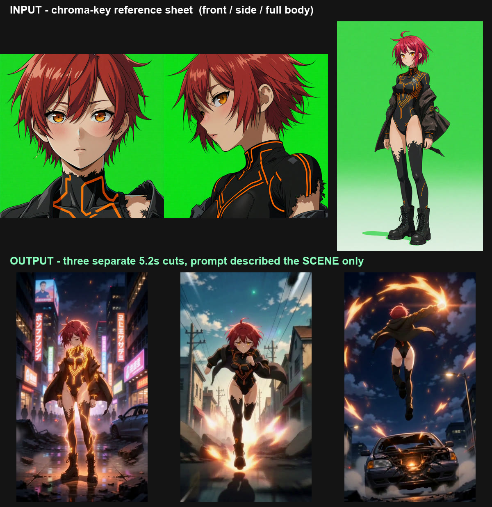
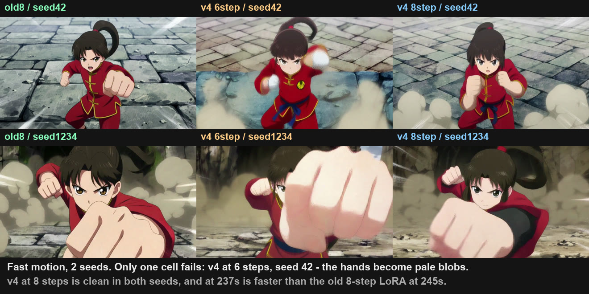
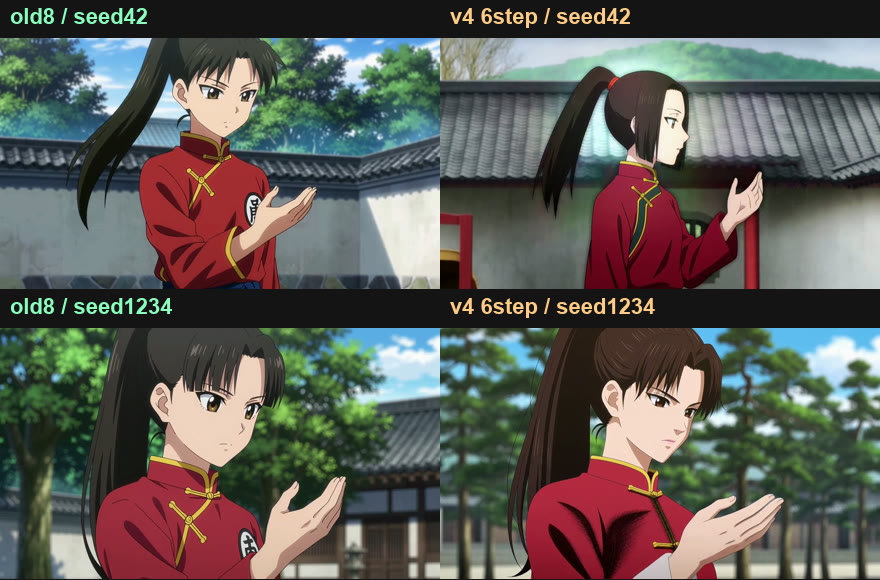
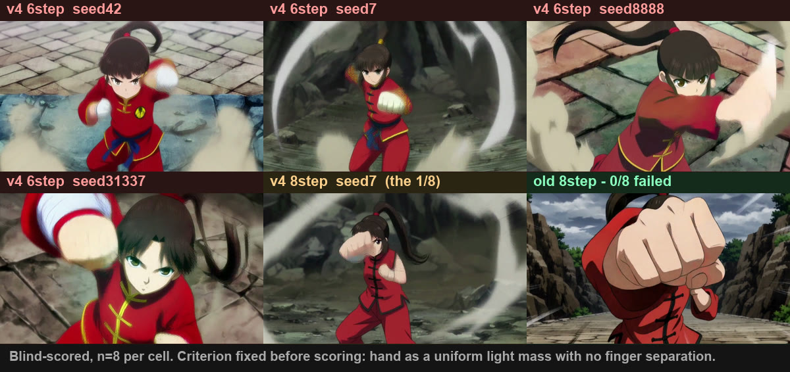
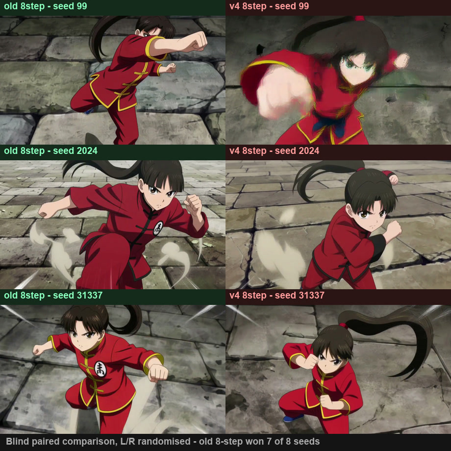

# MiniMax H3 — measured notes from one 16GB card

First-hand measurements and working scripts from running MiniMax H3 locally on a single
RTX 5080 (16GB). **This is not a general guide.** Every number here came off one machine with
one kind of content, and the whole reason it exists is that general guides did not match what
the machine actually did.

If you only read one section, read [the silent `ref_images` failure](#the-silent-ref_images-failure).

```
RTX 5080 16GB · 31GB system RAM · ComfyUI 0.33.1 · torch 2.12.0+cu130 · Windows
```

---

## Contents

| | |
|---|---|
| [The silent `ref_images` failure](#the-silent-ref_images-failure) | A wrong input shape is ignored with no error, and the output still looks fine |
| [Anchoring a clip to a still](#anchoring-a-clip-to-a-still) | The node with no image input, and how to prove the anchor took |
| [Camera speed costs more detail than step count](#camera-speed-costs-more-detail-than-step-count) | Four cells: slow camera doubled end-of-clip sharpness, 16 steps made it worse |
| [Prompts that ask for a count get clones](#prompts-that-ask-for-a-count-get-clones) | Counting language tiles the frame; variety has to be stated |
| [Describe the destination, not just the move](#describe-the-destination-not-just-the-move) | A camera move that ends somewhere new loses the look on arrival |
| [Character consistency across cuts](#character-consistency-across-cuts) | Three-view chroma-key sheets, scene-only prompts |
| [What the card actually does](#what-the-card-actually-does) | Frame ceiling, VRAM, resolution, timings |
| [The v4 LoRA that did not replicate](#the-v4-lora-a-single-seed-result-that-did-not-replicate) | A single-seed result reversed at n=2 |
| [Metric definitions](#metric-definitions) | What "sharpness" and "saturation" mean here, and two ways to measure them wrong |
| [Scripts](#scripts) | |
| [Limitations](#limitations) | Read this before trusting any number above |

---

## The silent `ref_images` failure

The reference-to-video node takes multiple reference images. The intuitive way to pass them is
a nested object. That is silently ignored:

```python
# WRONG — no error, no warning, node runs with zero references
"ref_images": {"ref_image_0": ["40", 0]}

# RIGHT — flat dot notation, as in the shipped workflow template
"ref_images.ref_image_0": ["40", 0]
```

ComfyUI's execution engine resolves a value into an image link only when it is literally
`[node_id, output_index]` at the position it inspects. **It does not descend into nested
dictionaries.** The inner `["40", 0]` is never substituted, so the node executes with no
references at all, and nothing raises.

Three reasons this is hard to catch:

1. **The output still looks right.** If the prompt describes the character's appearance — the
   natural thing to do — you get that character with zero references attached, and conclude the
   reference is working.
2. **The error message points the wrong way.** Passing `ref_image_0` at the top level gives
   `unexpected keyword argument 'ref_image_0'. Did you mean 'ref_images'?`, which reads as an
   instruction to nest it. The node source reinforces the misreading — it iterates
   `(ref_images or {}).values()`. The correct form is a third shape neither one suggests.
3. **The fix is in the workflow file, not the code.** The shipped template declares the input
   name as `"name": "ref_images.ref_image_0"`:
   ```
   ComfyUI\python_embeded\Lib\site-packages\comfyui_workflow_templates_json\templates\
     video_minimax_h3_r2v.json
   ```

**When a node's API is ambiguous, read the official working workflow before reading the source.**
The source tells you what the function accepts. The workflow tells you what the engine sends.

### Proving the references are actually doing something

A working run and a broken run look similar, so remove the confound — empty the appearance out
of the prompt entirely:

| Condition | Prompt | References | Result |
|---|---|---|---|
| A | Scene only | 3 images | Matches the character sheet |
| B | Scene only | none | An arbitrary person |

If A and B look the same, references are being ignored no matter what the code appears to say.
Secondary signal: reference processing adds roughly a minute per cut, so a suspiciously fast run
is a hint. See [`scripts/ref_ablation.py`](scripts/ref_ablation.py).

---

## Anchoring a clip to a still

Same failure family as `ref_images`, different node. To start a clip from a specific image you
want `MiniMaxH3ImageToVideo`, which takes `first_frame` and emits **both** the positive
conditioning and the AV latent:

```python
"20": {"class_type": "MiniMaxH3ImageToVideo",
       "inputs": {"clip": [...], "vae": [...], "prompt": prompt,
                  "width": W, "height": H, "length": frames,
                  "first_frame": ["40", 0]}},          # LoadImage
# the latent comes out of output 1 of the same node
"14": {"class_type": "SamplerCustomAdvanced",
       "inputs": {..., "latent_image": ["20", 1]}},
```

The mistake was reaching for `EmptyMiniMaxH3LatentAV` plus a `CLIPTextEncode`. That node has no
image input at all, so the still never enters the graph. Nothing errors — you get a perfectly
good clip generated from the text, which resembles the still because the same prompt wrote both.

### Verify with pixels, not with the graph

Reading the graph is what produced the bug in the first place. Extract frame 0 and difference it
against the source still:

| | mean abs difference | pixels within 20 |
|---|---|---|
| Anchored | 6.5 – 11.3 | 82 – 93% |
| Not anchored | 49 – 69 | 10 – 28% |

The two regimes are far enough apart that no judgement call is involved.

**And check the file you are measuring is the one you just made.** A "skip if the output already
exists" guard silently kept results from the previous, broken configuration, so the verification
ran against stale files and reported failure after the bug was fixed. If a harness skips work,
have it record *what* produced the file — prompt, first frame, frame count — and skip only when
that still matches.

---

## Camera speed costs more detail than step count

The still handed in as `first_frame` is sharp, the first second holds, and from around the
midpoint trunks smear and undergrowth turns to mush. Four cells, one variable each, same prompt
and seed:

| | steps | sigma shift node | camera | sharpness mid | sharpness end | time |
|---|---|---|---|---|---|---|
| A baseline | 8 | — | fast | 177.6 | 152.4 | 250s |
| B shift 12 | 8 | 12.0 | fast | 177.6 | 152.4 | 246s |
| C 16 steps | 16 | 12.0 | fast | 186.3 | 126.3 | 456s |
| **D slow camera** | 8 | 12.0 | **slow** | **282.1** | **324.3** | 248s |

**B is identical to A to four significant figures.** `MiniMaxH3SigmaShift` defaults to
`shift_video=12.0`, which is already what the model uses — adding the node changes nothing. It
was worth testing precisely because I was sure it was the cause.

**C is worse at the end than the baseline**, at 1.8× the cost. Consistent with the face result
above: more steps refine what the representation can hold, they do not enlarge it.

**D more than doubles end-of-clip sharpness at the same cost.** The only change was wording:

```
before:  flies fast and continuously forward, the nearest trunks rushing toward
         the lens and streaming past both edges. Constant rapid forward motion
after:   drifts forward slowly and steadily, the nearest trunks easing past the
         edges of frame. Slow deliberate forward motion
```

The distilled 8-step model has a fixed budget per frame. Large per-frame displacement spends it
on motion and there is nothing left for texture. Note the gap *widens* over the clip — 59% at the
midpoint, 113% at the end — so a single early frame will not show you this.

To keep the sense of travel without the smear, slow the camera and lengthen the clip instead:
124 frames → 226 covers similar ground at half the per-frame displacement, and time scales
linearly with frames.

Since H3 generates audio jointly, the audio line is worth slowing too — `rushing air` became
`soft moving air`. Not separately ablated.

Data: [`results/camera_speed.json`](results/camera_speed.json). Reproduce with
[`scripts/camera_speed.py`](scripts/camera_speed.py) then
[`scripts/measure_sharpness.py`](scripts/measure_sharpness.py).

---

## Prompts that ask for a count get clones

A forest that reads as a repeating game asset — the same tree stamped across the frame — traces
back to the prompt asking for a number and never asking for difference:

```
hundreds of trees receding to the horizon, all overlapping
packed completely full with no empty space
looking straight ahead into the direction of travel
```

Cloning is the cheapest way to satisfy a count, filling every gap is easiest by repetition, and a
dead-centre vanishing point makes the frame near-mirror-symmetric. Nothing in the negative
prohibited any of it.

Replacing the counting language with explicit variety — mixed species, trunk thicknesses from
sapling to giant, individual lean angles, broken and dead trunks, irregular spacing with real
gaps, vanishing point pushed off to one side — plus a negative covering `repeating pattern,
tiling, cloned, duplicated, wallpaper, symmetrical, mirrored, evenly spaced, rows, plantation`:

| | mean symmetry (n=8) |
|---|---|
| Before | 62.6 |
| After | **43.5** |

*(100 − mean absolute difference between a frame and its own mirror; higher is more symmetric.)*

**It split rather than improving everything.** The three cuts that fell below 16 all had a
structurally asymmetric subject — a slope, a ridgeline, a hillside. The five that stayed above 57
were all variations on *standing inside a wood looking forward*, where trunks get distributed
evenly left and right regardless of what the text asks.

Text suppressed repetition of individual elements. It did not fix global symmetry in a frontal
composition; choosing a subject that is asymmetric by construction did.

Data: [`results/repetition_symmetry.json`](results/repetition_symmetry.json).

---

## Describe the destination, not just the move

A camera move that ends somewhere new — descending through cloud to reveal the sea below — kept
the look for the first half and then went flat and grey on arrival.

The prompt was eight lines of cloud and one line of sea (`the sea rushing up toward the viewer,
its surface glittering under the sun`). Conditioning from the first frame governs the opening;
by the end the text is doing the work, and for the destination there was almost no text.

Writing the destination at the same length as the origin — what is on the ground, how light
arrives there, what floats in the air, and an explicit *the colour stays as deep and saturated at
the bottom as it was at the top* — on an equivalent set of descents:

| Cut | saturation, first frame → last | retained |
|---|---|---|
| canopy | 31.7 → 43.2 | 136% |
| mist | 23.9 → 40.2 | 168% |
| gorge | 39.9 → 46.9 | 118% |

Above 100% because these start backlit and blown out and descend into colour, so this shows the
failure is gone rather than sizing the fix. Confounded with a subject change (sea → forest floor)
and not separately ablated.

---

## Character consistency across cuts



Three steps, and the third is the one people skip:

| Step | What | Why |
|---|---|---|
| 1 | Flux generates three sheets on flat green — front face, side face, full body. Same seed. | The identity has to exist as pixels before it can be referenced |
| 2 | All three go in as separate reference slots | One view carries only the information in that view |
| 3 | The video prompt describes **scene and action only** — no appearance | Anything you state overrides the reference |

About five minutes per cut at 768×1344, 124 frames, 8 steps.

**Why flat green.** A reference transfers everything in it. A sheet shot against a sky drags that
sky into every cut, which defeats writing a different scene each time. Keep the sheet lighting
neutral too — a colour cast in the reference tints every cut.

**Why three views.** Each carries different information, and the gap shows up as a specific
failure:

| View | Carries | Failure without it |
|---|---|---|
| Front face | Features, eye colour | Identity drifts between cuts |
| Side face | Nose and jaw line, back of head | Profile shots get an invented face |
| Full body | Leg length, shoulder-to-waist ratio, lower costume | **Proportions collapse** |

**The rule that explains most failures:** what the prompt states wins; the reference only fills
what the prompt leaves empty. Three separate bugs traced back to this one rule — an East Asian
reference producing a Western character (ethnicity unstated, so the model used its default), a
new reference still producing the old character (the costume description was still in the
prompt), and consistency surviving with references disabled (the prompt described everything).

**If you change the reference, change the prompt's description of the person too** — or better,
remove appearance from the prompt entirely and let the reference own it.


Getting an extreme facial close-up out of Flux mostly does not work; repeated attempts still
framed the upper body. Detecting the subject against the green and cropping the head is more
reliable than arguing with the prompt.

See [`scripts/flux_charsheet_green.py`](scripts/flux_charsheet_green.py) and
[`scripts/make_two.py`](scripts/make_two.py).

---

## What the card actually does

### Frame ceiling

Published guidance puts a 16GB laptop GPU at
[5 seconds at 960×540](https://minimax-h3.wiki/local/minimax-h3-hardware-requirements/).
Measured on a 16GB desktop card at **1344×768** — about 2.7× those pixels:

| Frames | Length | Time | Peak VRAM |
|---|---|---|---|
| 124 | 5.2s | 4.8 min | 15.35 GB |
| 209 | 8.7s | 9.5 min | 15.02 GB |
| 260 | 10.8s | 13.8 min | 11.50 GB |
| 311 | 13.0s | 19.1 min | 13.55 GB |
| **362** | **15.1s** | 25.3 min | 15.33 GB |
| 430 | 17.9s | **OOM** | — |

Time scales close to linearly with frame count, unlike resolution. Quality does not decay along
the clip — at 13s into a 15s generation, faces, fingers and clothing knots are intact.

Frame counts snap to a 17k+5 lattice. Ask for 424 and you get 430. Valid: 124, 209, 260, 311,
362, 379, 396, 413, 430.

### VRAM is not the bottleneck — system RAM is

Peak VRAM stayed between 11.5 and 15.4 GB **regardless of resolution or frame count**. Dynamic
VRAM streaming offloads harder as the job grows, so VRAM stays roughly pinned while PCIe traffic
rises — which is also why time explodes above 1080p while VRAM does not move.

The DiT and text encoder stream from system RAM. Two settings mattered more than any GPU tuning:

| Setting | Why |
|---|---|
| `--disable-pinned-memory` | Otherwise a large share of system RAM is page-locked. Locked pages cannot swap, so the OOM killer takes the process. Measured 29.8GB → 7.5GB host RAM |
| WSL2 memory cap | WSL2 claims up to half of host RAM by default and does not return it after freeing it inside the VM |

If a run dies without a CUDA OOM message, look at host RAM first.

### More steps does not fix a face

Twenty steps cost three times the time and produced the same mangled face. The model works on a
latent grid downsampled ~32× from the output:

| Output | Token grid |
|---|---|
| 768 × 448 | 24 × 14 = 336 |
| 1344 × 768 | 42 × 24 = 1008 |

A face occupying 20–30 px of a 768×448 output is **under one token**. It was not drawn badly —
there was no unit to draw it with. Steps refine what the grid can represent; they cannot create
grid. The fix is resolution or framing, not sampling.

### Timings across resolutions

| Resolution / frames | Time |
|---|---|
| 1280 × 720 / 73f | 95s |
| 1344 × 768 / 124f | 290s |
| 1536 × 864 / 97f | 285s |
| 1920 × 1088 / 73f | 668s |
| 1920 × 1088 / 124f | 783s |

1920×1088 exceeds the nominal max pixel count and is still visibly better — separated hair
strands, iris gradients, background depth — at 2.7× the time. Iterate at 1344×768, render finals
at 1920×1088.

### Chained generation converges rather than drifting

Feeding the last frame of one segment in as the first frame of the next. The usual warning is
that drift compounds by the third to fifth segment. Measured saturation over twelve segments:

| Segment | Saturation | vs seg 1 |
|---|---|---|
| 1 | 42.7 | baseline |
| 2 | 59.7 | +39.8% |
| 3 | 71.2 | +66.6% |
| 6 | 72.8 | +70.5% |
| 12 | 73.7 | +72.5% |

Two thirds of the change happens by segment 3; the next nine segments add six points between
them. This is a one-time text-to-video → image-to-video conditioning difference followed by a
slow crawl, not compounding drift.

The real constraint on chaining is different: **only what is visible in the handoff frame
survives.** Chain from a close-up of a hand and you lose the character, the other subjects and
the art style at once. Let your harness choose which earlier frame to inherit from.

---

## The v4 LoRA: a single-seed result that did not replicate

Worth reading as a cautionary tale about n=1, because it is one.

The [v4 turbo LoRA](https://github.com/Larryvrh/ComfyUI-MiniMax-H3-Turbo) is recommended by its
author as "the strongest checkpoint so far … markedly better micro-detail (faces, fingers,
texture)," with one stated exception:

> "The one trade-off shows up **only at 4 steps with large, fast motion**, where v4 can produce
> motion-smear / trailing ghosting … **Using 6–8 steps largely removes it**."

A single fast-fight generation at 6 steps appeared to contradict that — v4's hands came out as
pale featureless blobs while the older 8-step LoRA rendered knuckles. Re-run as a grid of two
content types × three configurations × two seeds, the finding evaporated:



| Content | Configuration | Hands | Time |
|---|---|---|---|
| Fast motion | old 8-step @ 8 | clean in both seeds | 245s |
| Fast motion | v4 @ 6 | **blobbed in 1 of 2 seeds** | 184s |
| Fast motion | v4 @ 8 | clean in both seeds | 237s |
| Slow / static | old 8-step @ 8 | clean in both seeds | 245s |
| Slow / static | v4 @ 6 | clean in both seeds | 184s |



That was n=2, and it was also wrong. Six more seeds per cell — 24 fast-motion generations,
scored blind against a criterion fixed in advance, key opened only after scoring:



| Configuration | Hands failed | Rate | Time |
|---|---|---|---|
| old 8-step @ 8 | **0 of 8** | 0% | 245s |
| v4 @ 6 | **4 of 8** | **50%** | 186s |
| v4 @ 8 | **1 of 8** | 12.5% | 237s |

So the failure is not occasional — at 6 steps it is a coin flip — and 8 steps reduces it rather
than removing it. **Both earlier conclusions were wrong, in opposite directions.** n=1 saw a real
effect and could not size it; n=2 mistook 0-of-2 for reliability, when a 12.5% failure rate
produces a clean pair about 77% of the time.

The blinding mattered. I expected v4 at 8 steps to score clean — that was my position going in —
and it scored one failure. Judging against a written criterion with the labels hidden is what let
that through.

### The hands were only half of it

Watching the clips back rather than reading tables, the older LoRA simply looks better -
background texture, line definition, material surfaces - regardless of the hands. Separate claim,
so separate blind test: same seed both sides, left/right randomised, no labels, question fixed in
advance (which side retains more detail, ignoring hands).



**The older 8-step LoRA won 7 of 8 pairs.**

Two independent blind passes over the same 24 generations, both pointing the same way: zero hand
failures against one, and 7-1 on detail.

**Recommendation:** for fast motion use the older 8-step LoRA - 0 of 8 on hands, 7 of 8 on
detail, at 245s against 237s. v4 at 6 steps is 24% faster and fine for iteration passes where you
are checking composition, but it is a coin flip on hands and loses texture. On slow or static
content neither failed, which is the case the author recommends v4 for.

One limitation worth stating: the hand scoring used a single frame per clip at t=2.0s. This is a
motion artifact, so a per-clip multi-frame pass (`scripts/blind_prep_multi.py`) may find more
failures than reported here. It has not been run.

### Why the sharpness metric was useless here

| Cell | seed 42 | seed 1234 | mean |
|---|---|---|---|
| old 8-step, fast | 133.6 | 77.1 | 105.4 |
| v4 @ 6, fast | 81.7 | 83.7 | 82.7 |
| v4 @ 8, fast | 85.1 | 68.5 | 76.8 |

The old-8-step cell ranges from 77.1 to 133.6 across two seeds — a spread wider than the gap
between any two configurations. The original comparison happened to draw the 133.6 seed for the
old LoRA and an 81.7 seed for v4, which is the entire "result"; at the other seed the ordering
reverses.

**When seed-to-seed variance exceeds the effect you are measuring, a single-seed comparison is
not evidence** — and the metric will still hand you a confident number. The cause is visible in
the image above: different seeds produced completely different framing, so sharpness is measuring
composition as much as quality.

Raw data: [`results/results_loran.json`](results/results_loran.json) (timings, VRAM) and
[`results/results_loran_metrics.json`](results/results_loran_metrics.json) (per-clip metrics).
Reproduce with [`scripts/lora_n.py`](scripts/lora_n.py) then
[`scripts/measure_loran.py`](scripts/measure_loran.py).

---

## Metric definitions

Any writeup quoting a sharpness number owes you its definition, because the word covers several
incompatible statistics. Here:

```python
sharpness  = mean over sampled frames of cv2.Laplacian(grey, cv2.CV_64F).var()
saturation = mean over sampled frames of cv2.cvtColor(f, cv2.COLOR_BGR2HSV)[:,:,1].mean()
```

Frame stride 5 throughout. See [`scripts/measure_metrics.py`](scripts/measure_metrics.py) and
[`results/metrics_verified.json`](results/metrics_verified.json).

### Two ways to measure this wrong

**Comparing sharpness across resolutions.** Laplacian variance is per-pixel, so a larger frame
carrying the same edges scores *lower*. Measured at native size, 1344×768 returns 133.6 and
1920×1088 returns 45.5 — which would "prove" the higher resolution is three times worse. It is
not. Downscaling both to a common size first does not fix it either, because the downscale
factors differ. **This statistic cannot compare two resolutions in either direction.** Use it
within one resolution and judge resolution by eye.

**Cropping a region to compare.** Changing a LoRA or a step count changes the generation, and
therefore the composition. Cropping identical coordinates compares different content. Compare
full frames.

**And: an unrecorded method is an unverifiable number.** The sharpness and saturation figures in
the original notes were written down without their definitions. Recomputing them from the same
files reproduced the ratios — the A/B sharpness ratio came out 1.64 against a recorded 1.68, and
the saturation curve matched within a few points — but absolute values differ by a constant
factor and one ordering swapped. The conclusions held; the fact that this could not be known in
advance is the point.

---

## Scripts

Paths are hardcoded for the author's machine. Change the constants at the top of each file.

| Script | What |
|---|---|
| [`bench5.py`](scripts/bench5.py) | A/B harness — builds the graph, submits, watches VRAM, records timings |
| [`measure_metrics.py`](scripts/measure_metrics.py) | Sharpness / saturation with the definitions above |
| [`lora_n.py`](scripts/lora_n.py) | Raising n on the LoRA question — 2 content types × 2 seeds × steps |
| [`ref_ablation.py`](scripts/ref_ablation.py) | Confirms references are actually being applied |
| [`camera_speed.py`](scripts/camera_speed.py) | Four cells isolating steps / sigma shift / camera speed |
| [`measure_sharpness.py`](scripts/measure_sharpness.py) | Sharpness, symmetry and saturation at the clip midpoint and end |
| [`flux_charsheet_green.py`](scripts/flux_charsheet_green.py) | Three-view chroma-key character sheets |
| [`make_two.py`](scripts/make_two.py) | End-to-end: two characters, three cuts each |

ComfyUI launch flags used throughout:

```
--disable-pinned-memory --disable-async-offload --disable-smart-memory --reserve-vram 1.5
```

---

## Limitations

Worth being blunt about, because the whole point of this repo is that other people's numbers
did not transfer:

- **One GPU, one model, largely one content type** (anime-style action). A different card or a
  different subject will give a different table.
- **Most cells are n=1 on a single seed.** The one comparison that was re-run at n=2 reversed,
  which is not reassuring about the rest. Treat any single-seed number here as provisional.
- **Sharpness is a blunt instrument.** It does not capture "the hands became featureless
  blobs", which was the deciding factor in one comparison. Look at the frames.
- **The camera-speed and symmetry sections are n=1 per cell on one scene.** The effect sizes
  there were large enough to see without the metric, which is the only reason they are stated at
  all; the magnitudes are not to be trusted at the quoted precision.
- Scripts assume Windows paths and a local ComfyUI at `127.0.0.1:8188`.

Corrections welcome — particularly from anyone whose numbers disagree, since that is the
interesting case.
